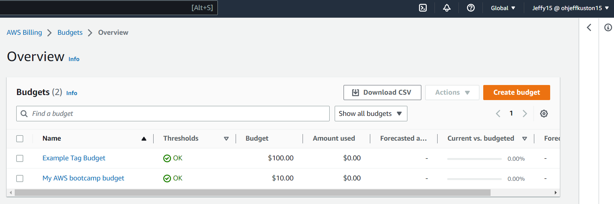
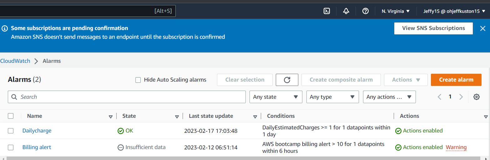

# Week 0 — Billing and Architecture

## Required Homework

### Install AWS CLI

I was able to install AWS CLI using gitpod, prove is in a branch i created labelled week-1.

### Budget and Billing Alarm

I created a budget and billing alarm, prove is in the week-1 branch.

### Recreation of Logical Architectural Design

I recreated a crudder logical design using LucidChart. 

[Lucid Chart Share Link](https://lucid.app/lucidchart/80eebce6-30d8-42e5-9afe-a3ee0b6eb537/edit?viewport_loc=-179%2C82%2C2560%2C1152%2C0_0&invitationId=inv_467bfd4a-ac86-4b1e-8bb0-51be55b82547)

### Recreation of Conceptual Architectural Design (NapKin)

I recreated a crudder conceptual design (Napkin) using LucidChart.

.png)

[Lucid Chart Share Link](https://lucid.app/lucidchart/866fda17-5372-4101-b648-2338777cb3dc/edit?viewport_loc=-438%2C-18%2C1707%2C768%2C0_0&invitationId=inv_c248c025-c8c5-4e1d-858f-299f9566fbe9)

## Homework Challenges

### References

Referencing files in my repo

[Week-1/aws/json/billingalarm.json](https://github.com/ohjeffkuston/aws-bootcamp-cruddur-2023/blob/week-1/aws/json/billingalarm.json)

[Budget-notifications-with-subscribers.json](https://github.com/ohjeffkuston/aws-bootcamp-cruddur-2023/blob/week-1/aws/json/budget-notifications-with-subscribers.json)

[Week-1/aws/json/budget.json](https://github.com/ohjeffkuston/aws-bootcamp-cruddur-2023/blob/week-1/aws/json/budget.json)
