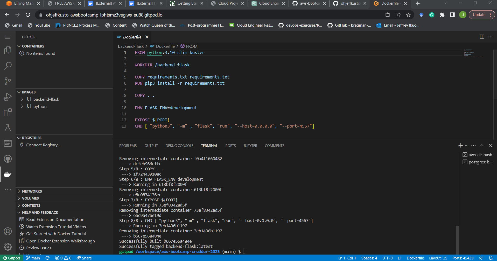
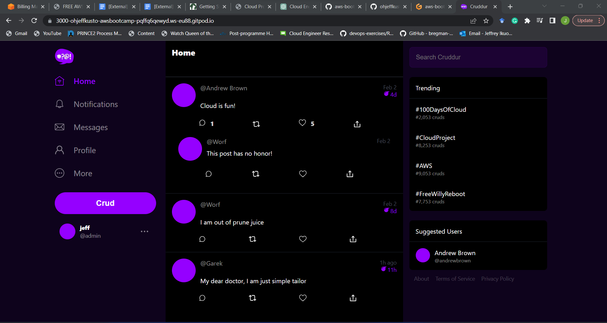
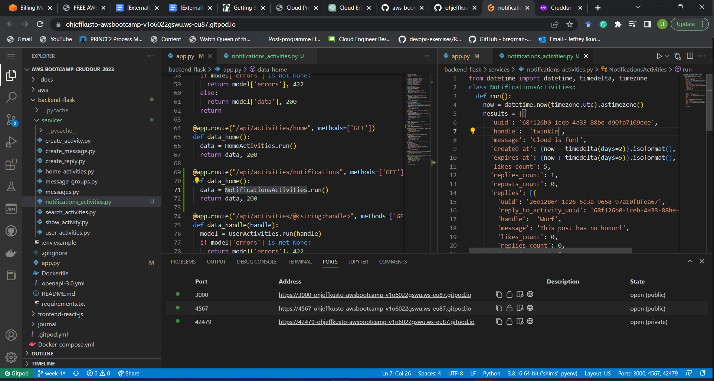
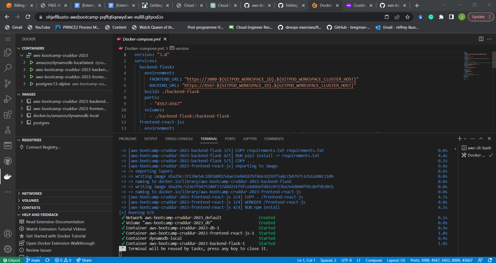
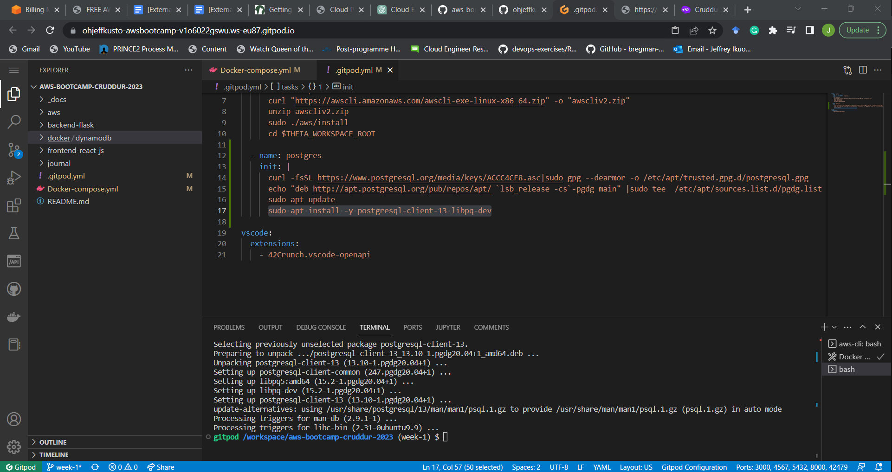
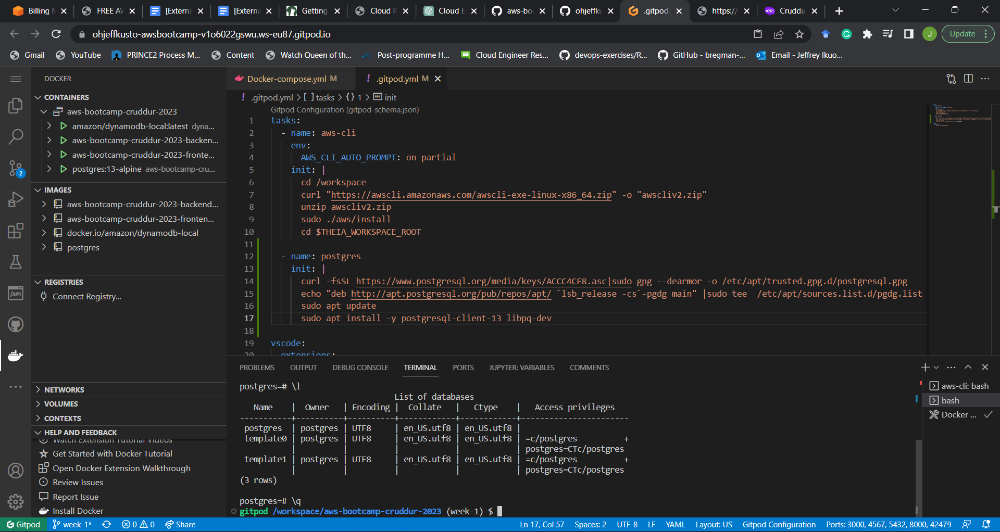
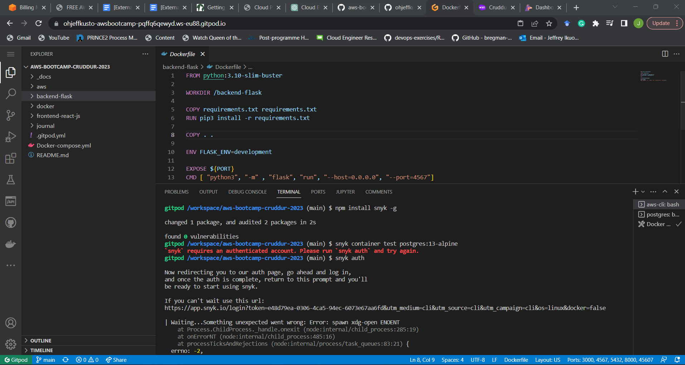
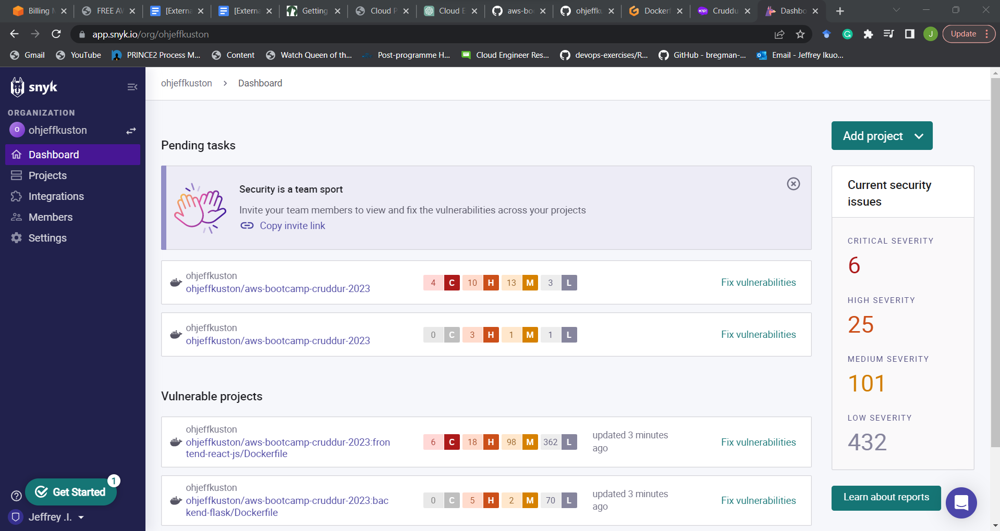

# Week 1 — App Containerization

## Required Homework

### Dockerfile Build

- I built a containerized application using a Dockerfile.

### Addition of the Notification Feature

- I made modifications to the frontend-react javascript file to include the notification feature in the crudder app.

### Docker Compose 

- I used a docker-compose yaml file to spin up multiple containers.

### Built a Postgres Database

- I spined up a postgres database using a docker compose and logged into the database.

## Container Security best practices

- I used the snyk container security tool to find and fix possible vulnerabilities in the container images.

## Homework Challenges

### References

Referencing files in my repo

- This reference contains a docker-compose yaml file used to spin multiple containers to spin up the cruddur app.
- It also contains modifications to include notifications in the UI of the cruddur app. 

[Docker-compose evidence](https://github.com/ohjeffkuston/aws-bootcamp-cruddur-2023/blob/main/Docker-compose.yml)

[Modifications to include notification](https://github.com/ohjeffkuston/aws-bootcamp-cruddur-2023/blob/main/backend-flask/services/notifications_activities.py)
