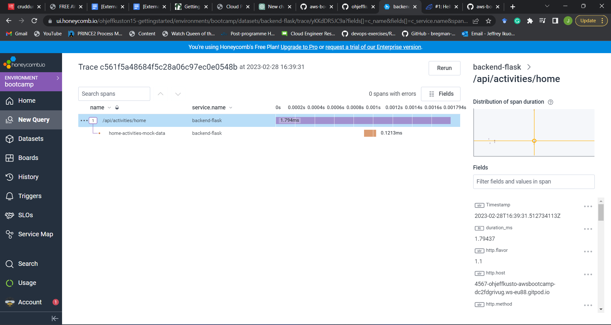
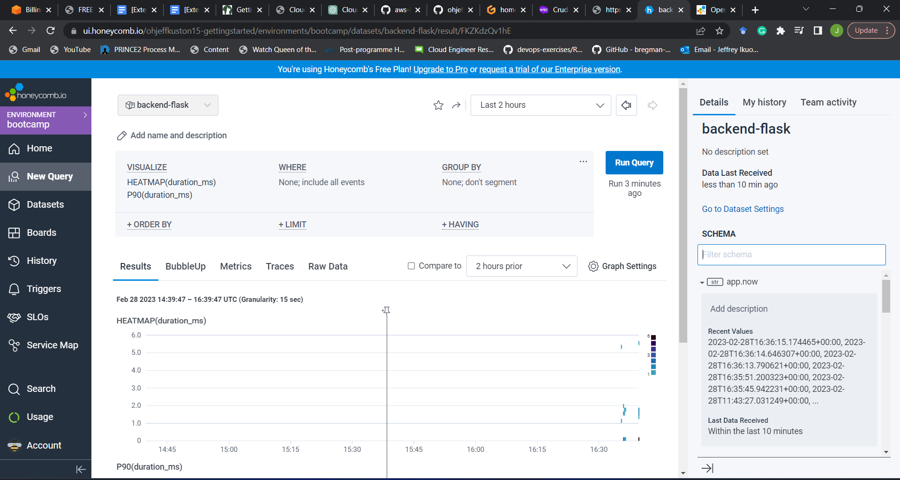
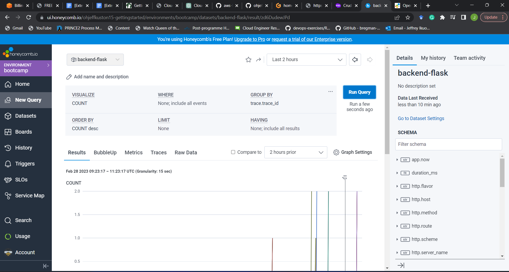
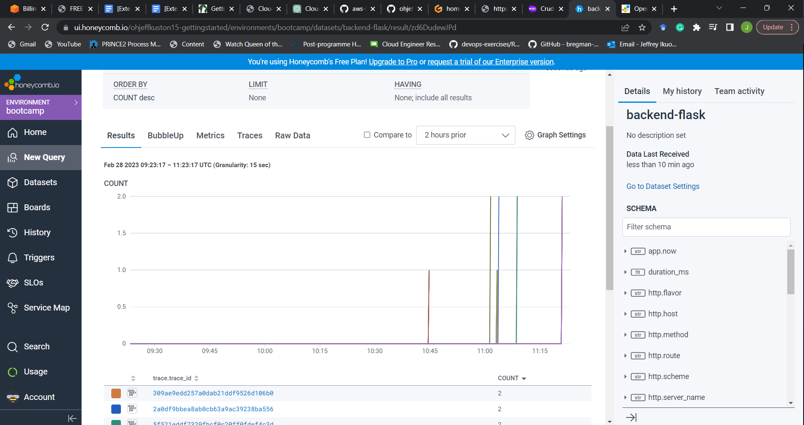
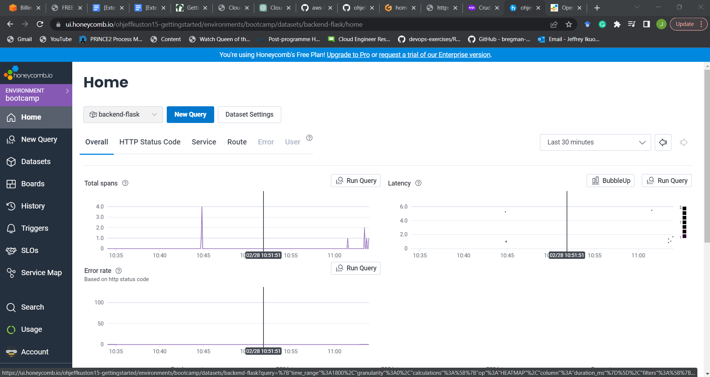
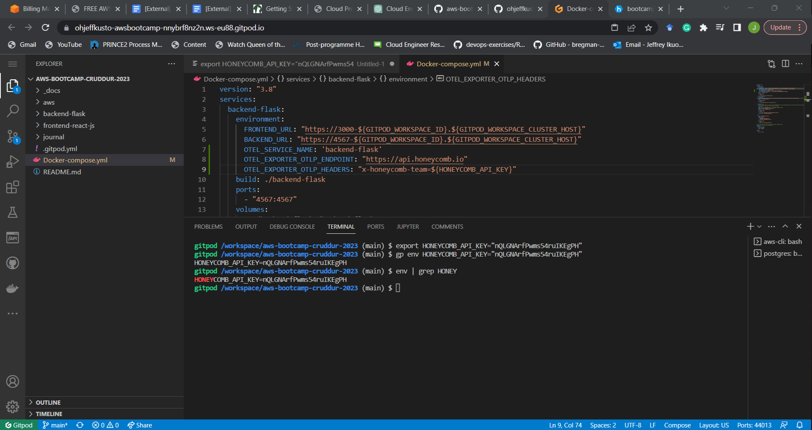
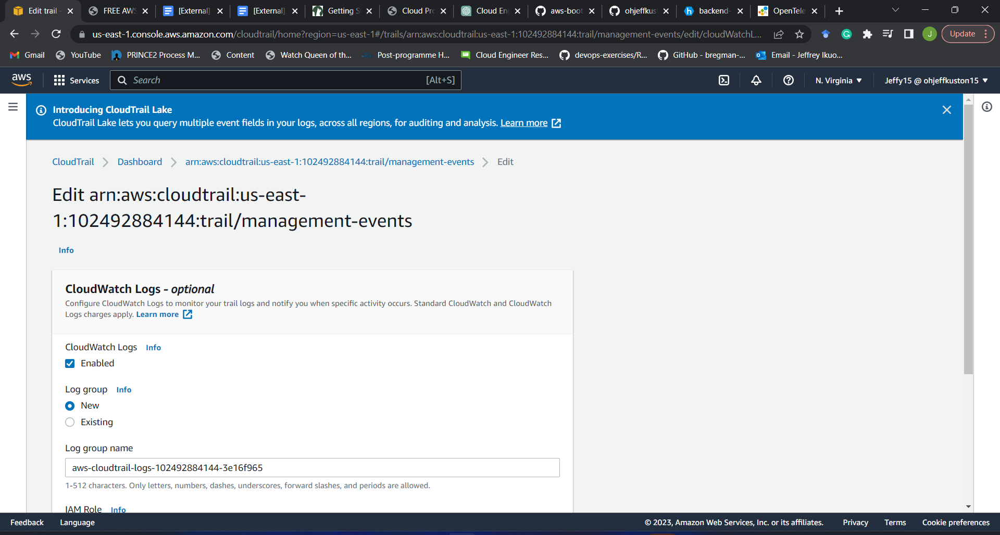
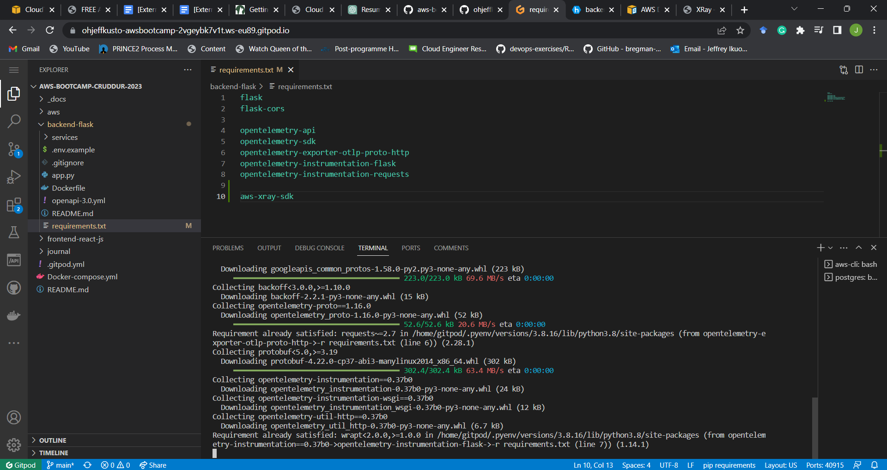
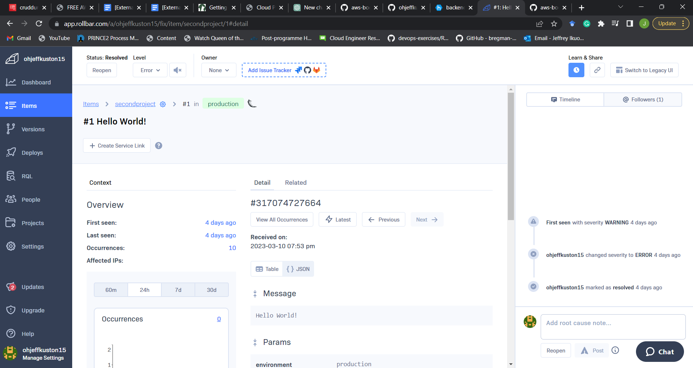

# Week 2 — Distributed Tracing

## Required Homework

### Honeycomb for frontend application

- Honeycomb for the frontend application to observe network latency between the frontend and backend.

- I added custom instrumentation to Honeycomb to add more attributes for observability

### Implementation of Cloudtrail for Observability

- I implemented cloudtrail for observability

### Implementation of X-ray for Observability

### Implementation of rollbar for Observability

- Rollbar for instrumentation

